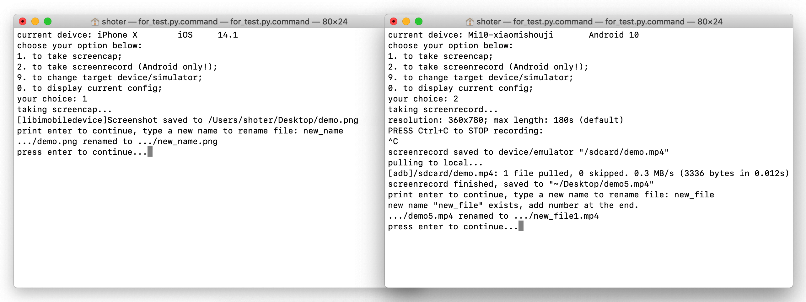

# screen_shoter


Screen Shoter is a tool (script) runs in terminal of macbook, which aimed to make it easier taking screenshot for mobile devices.  

Android & iOS supported.

## Getting started

### Requirement

* Macbook & zsh shell (not verified in other shells yet)
* python3
* adb (Android SDK Platform-tools)
* libimobiledevice
* Enable developer mode then turn on usb debugging of Android real device

### Download

You need noly one single file, **screen_shoter.py.command**, to run this tool. Other files were used for develop.  

Download this file, or simply copy the code to a text file.

## Usage

Add executable permissions to the file:  
```
chmod +x [path]
```

Make sure device(s) connected to computer (via usb). If the device is connected for the first time, allow debuging (Android) or trust computer (iOS).  

Double click **screen_shoter.py.command**, script will start to run in terminal, then follow the guide to use.

### Config

Options were stored in instance variables of class Config. You can modify them manually. Open **screen_shoter.py.command** in a text editor, class Config lies at the beginning. Within the __init__ method, all configs and their descriptions listed.

Some options:
* **self.interpreter_path**:   set the python interpreter.
* **self.default_save_path**:  where to save screenshot.
* **self.resolution_setting**: set the resolution of screenrecord (for Android).
* **self.time_limit**:         set the max length of screenrecord (for Android).
* **self.interface**:          skip initial_interface if set to 2.
* **self.product_type_name**:  the common name corresponding to the product_type of iPhone. May not up to date...

## Note

Screenrecord is not supported for iOS devices.

Some Android device may not support taking screenrecord using adb command... You may run this command in terminal to verify:
```
adb shell screenrecord /sdcard/demo.mp4
```
Press Control + C to stop recording.
